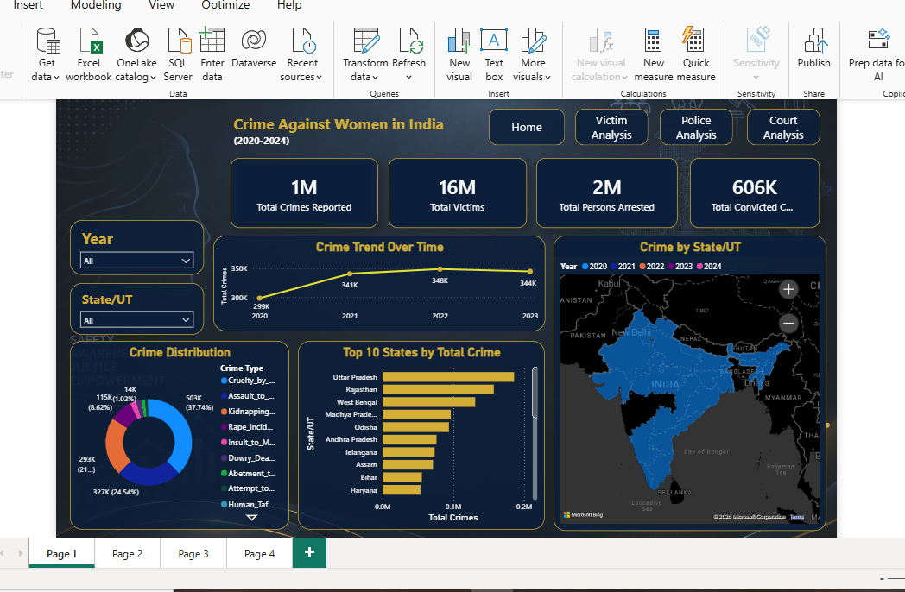
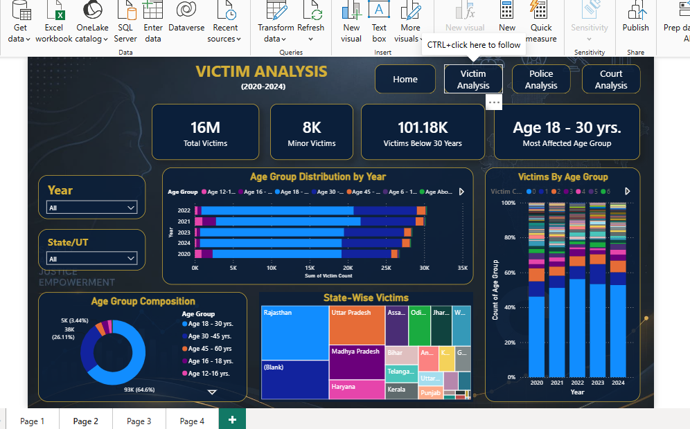
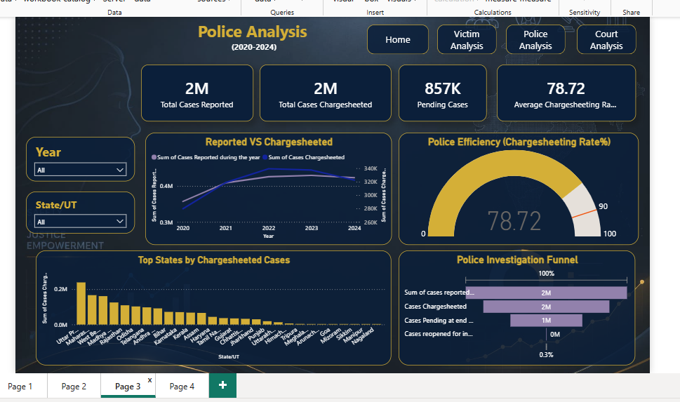
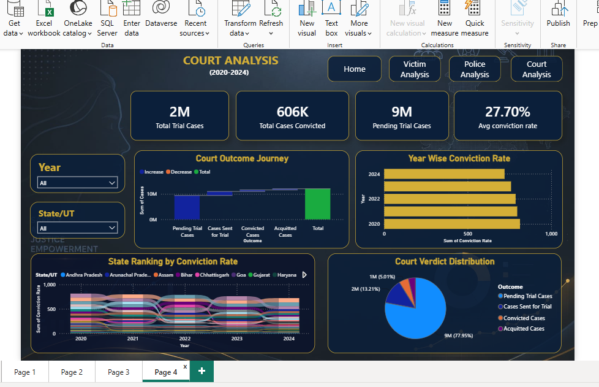

# Crime Against Women in India Dashboard

This Power BI dashboard analyzes NCRB data from 2020–2024.

## Tools Used
- Power BI
- Excel
- DAX

## Dashboard Pages
1. Home Dashboard
2. Victim Analysis
3. Police Analysis
4. Court Analysis

## Key Insights
- State-wise crime hotspots
- Victim age group analysis
- Police chargesheeting efficiency
- Court conviction trends

## Dashboard Preview

### Home Dashboard

### Victim Analysis

### Police Dashboard

### Court Dashboard

